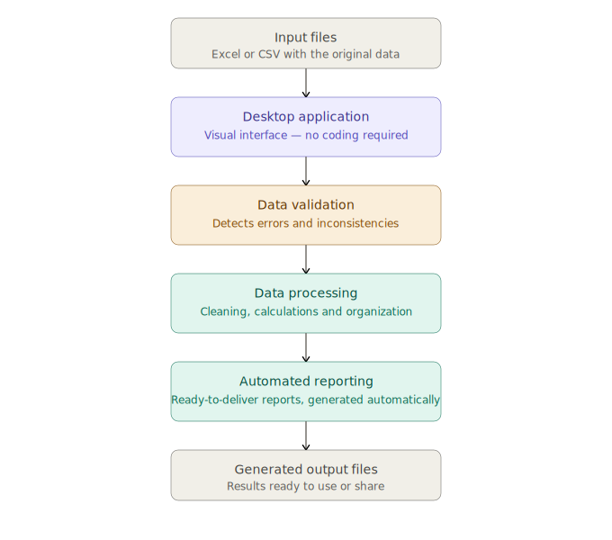
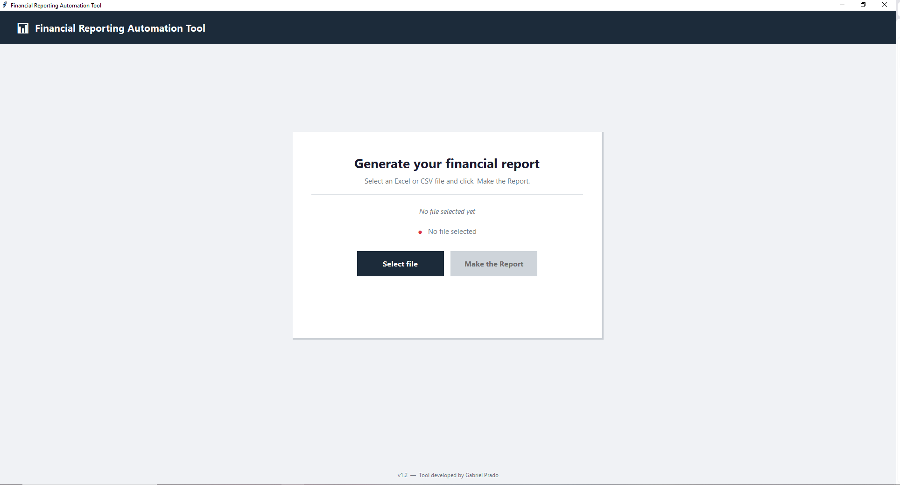
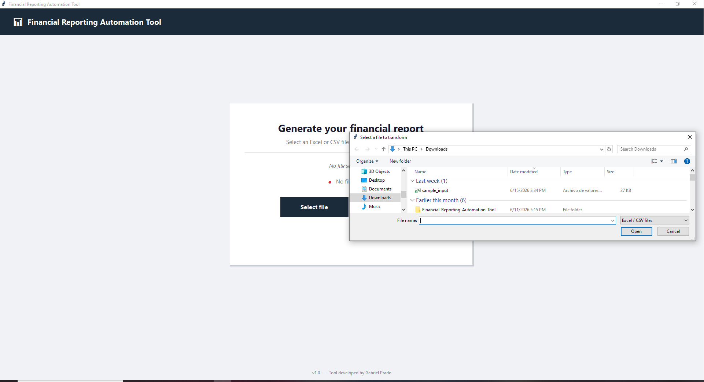
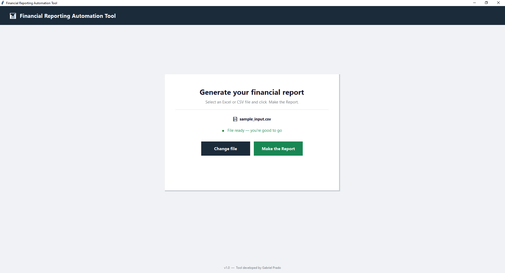
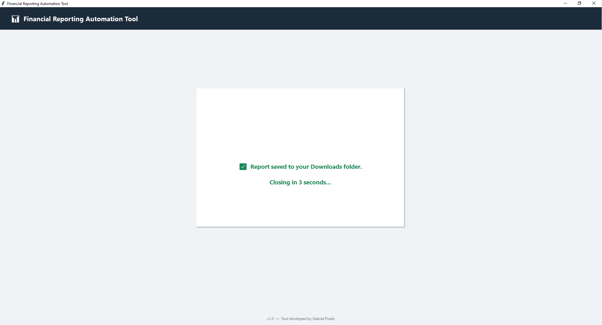
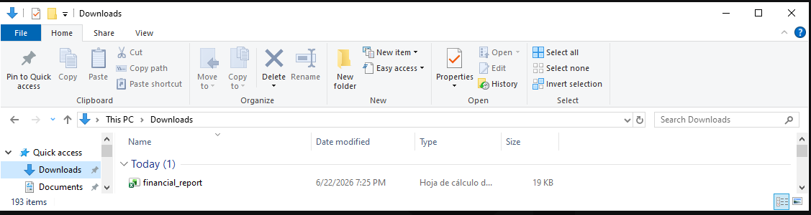

# Financial-Reporting-Automation-Tool
Business process automation solution built with Python and Pandas that transformed a 4-hour manual financial reporting workflow into a fully automated process completed in seconds.

## Project Overview

The Financial Reporting Automation Tool is a desktop application developed to automate a repetitive financial reporting process that previously required extensive manual effort.

The project was designed as a cost-effective alternative to commercial software solutions while meeting strict business requirements for accuracy, reliability, and ease of use. The application processes financial data, performs validation and transformation tasks, and generates reports automatically through a user-friendly desktop interface.

---

## Business Problem

Administrative personnel were required to manually process and consolidate financial data on a recurring basis. The workflow involved multiple manual steps, resulting in approximately four hours of work for each reporting cycle.

The organization evaluated commercial software solutions; however, implementation costs exceeded the available budget. Additionally, the external systems involved in the process did not provide APIs or integration mechanisms, preventing traditional automation approaches.

The organization required a desktop-based solution capable of operating locally while maintaining a high level of accuracy due to the sensitive nature of financial and accounting data.

---

## Project Objectives

* Reduce report generation time.
* Eliminate repetitive manual processing tasks.
* Improve operational efficiency.
* Minimize the risk of human error.
* Provide a cost-effective alternative to commercial software solutions.
* Maintain data integrity and processing accuracy.
* Deliver the solution within a strict business deadline.

---

## Project Constraints

* Maximum delivery timeline of 12 days.
* Sensitive financial and accounting information.
* No available APIs from third-party systems.
* Desktop-only deployment requirement.
* Limited budget for acquiring external software.
* High accuracy requirements with zero tolerance for data corruption.

---

## Solution Architecture



---

## Technologies Used

* Python
* Pandas
* Tkinter
* Threading
* OS
* PyInstaller
* Excel/CSV Processing
* Desktop Application Development

---

## Deployment

The application was packaged as a standalone Windows executable using PyInstaller, allowing end users to run the solution without installing Python or additional dependencies.

### Platform Support

* Windows (Primary Deployment Target)

The solution was originally designed for Windows environments based on organizational requirements and deployment constraints.

---

## Key Features

* Automated data ingestion.
* Data validation and consistency verification.
* Financial data transformation and processing.
* Automated report generation.
* User-friendly desktop interface.
* Local execution without external dependencies.
* High-speed processing of recurring reporting tasks.

---

## Technical Challenges

* Delivering a production-ready solution within a strict 12-day deadline.
* Ensuring data integrity when processing sensitive financial information.
* Building a reliable automation workflow without access to third-party APIs.
* Maintaining reporting accuracy while drastically reducing processing time.
* Creating a solution accessible to non-technical users.

---

## Results and Impact

### Operational Metrics

| Metric                    | Before   | After                 |
| ------------------------- | -------- | --------------------- |
| Report Generation Time    | ~4 Hours | Seconds               |
| Manual Intervention       | High     | Minimal               |
| Human Error Exposure      | High     | Significantly Reduced |
| Process Efficiency        | Low      | High                  |
| Software Acquisition Cost | High     | Avoided               |

### Business Outcomes

* Reduced report generation time from approximately four hours to seconds.
* Eliminated repetitive manual processing activities.
* Improved operational efficiency for administrative personnel.
* Enabled staff to focus on higher-value business activities.
* Successfully delivered the solution within the required business deadline.
* Improved confidence in report accuracy through automated validation controls.
* Demonstrated that an internal solution could satisfy business requirements.
* Eliminated the need for a costly third-party software investment.

---

## Business Value

This project served as a proof of concept for evaluating a potential software acquisition. Following successful deployment and validation, the organization determined that investing in an external commercial solution was no longer necessary.

The project not only automated a critical business process but also contributed to cost avoidance and improved resource utilization.

---

## Lessons Learned

* The importance of understanding business processes before implementing technical solutions.
* Strategies for maintaining data integrity in automated workflows.
* Delivering high-impact solutions under strict deadlines.
* Designing software for non-technical end users.
* Balancing development speed with reliability and accuracy requirements.

---

## Usage

The application runs as a single-window desktop tool. Follow the steps below to generate your financial report.

---

### Step 1 — Launch the Application



Upon opening the tool, the main window is displayed with two buttons:
- **Select file** → enabled, ready to open a file browser
- **Make the Report** → disabled until a valid file is selected

---

### Step 2 — Select Your Input File



Clicking **Select file** opens a Windows file explorer dialog filtered to **Excel / CSV files only**.  
Navigate to the location of your input file and select it.

> **Supported formats:** `.xlsx`, `.xls`, `.csv`

---

### Step 3 — File Ready Confirmation



Once a valid file is selected, the interface updates:
- The filename is displayed (`sample_input.csv`)
- A green indicator confirms **"File ready — you're good to go"**
- **Make the Report** button becomes active
- **Select file** changes to **Change file**, allowing you to swap the file if needed

---

### Step 4 — Report Generation



Clicking **Make the Report** processes the input file and triggers a confirmation message:

> ✅ *Report saved to your Downloads folder.*  
> *Closing in 3 seconds...*

The application closes automatically after the countdown.

---

### Step 5 — Output File



The generated report is saved as an Excel file (`.xlsx`) directly to your **Downloads** folder.  
No additional configuration or save dialog is required.

| Output detail | Value |
|---|---|
| Format | `.xlsx` (Excel Workbook) |
| Location | `This PC > Downloads` |
| Filename | `financial_report` |

---

## Sample Data

This repository includes synthetic sample datasets created exclusively for demonstration and testing purposes.

The sample files do not contain real financial information, customer records, or organizational data.

---

## Build Instructions

> **Requirement:** Run from the VS Code integrated terminal.  
> Open it via **Terminal → New Terminal** in the top menu bar,  
> then make sure to select **Command Prompt** or **PowerShell** (not Git Bash).

To generate a standalone Windows `.exe`:

```cmd
pyinstaller --onefile --windowed --name your_app_name main.py
```

**Notes:**
- `--onefile` → bundles everything into a single `.exe`
- `--windowed` → suppresses the console window on launch
- `--name` → replace `your_app_name` with your app name, no quotes, no spaces
- Output `.exe` will be located in the `dist/` folder of your project

---
